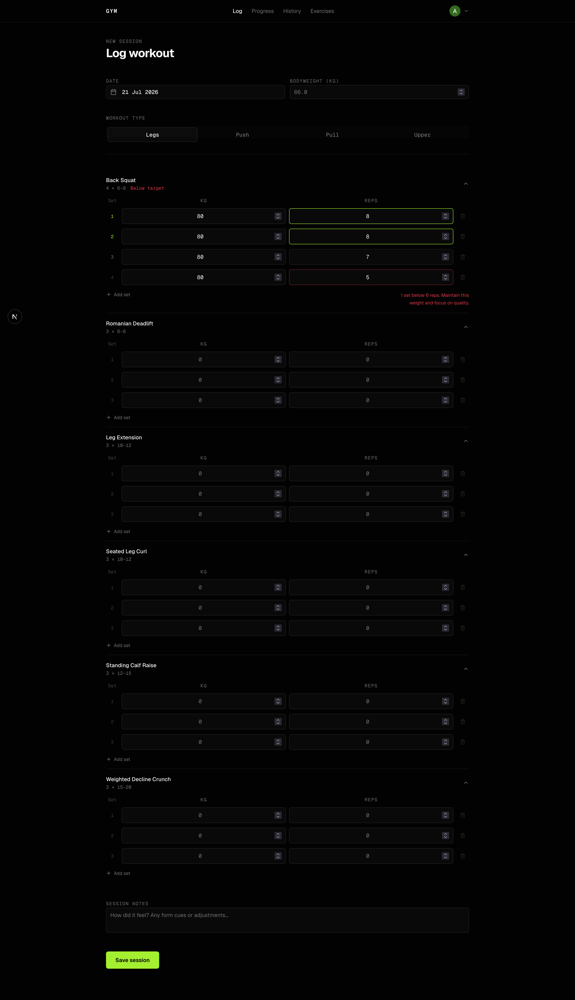
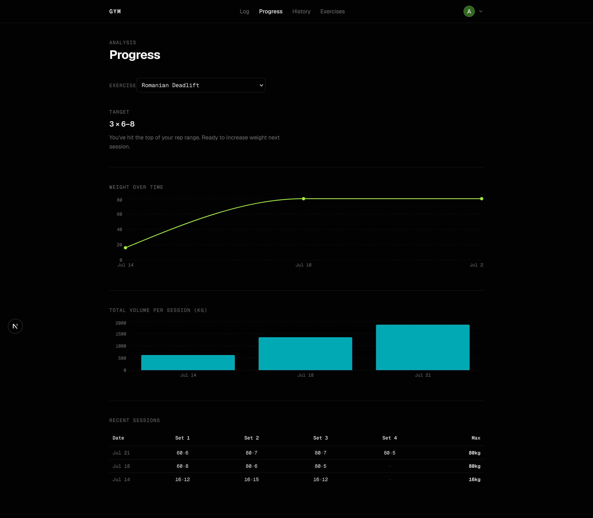
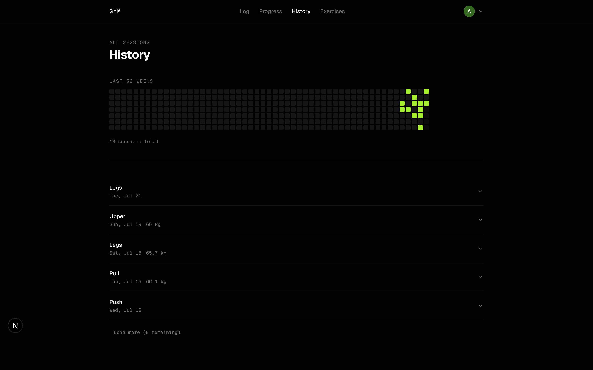
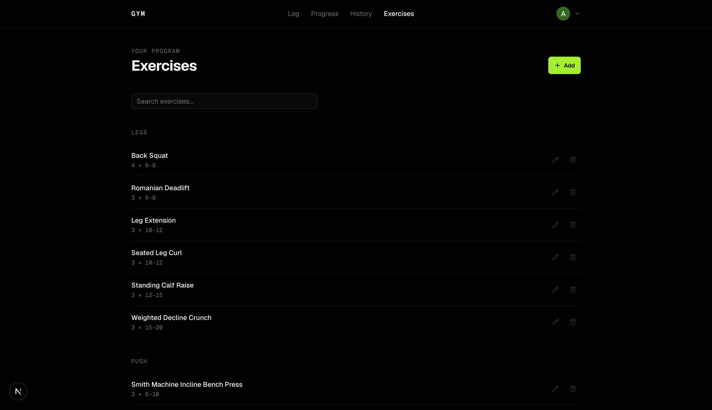
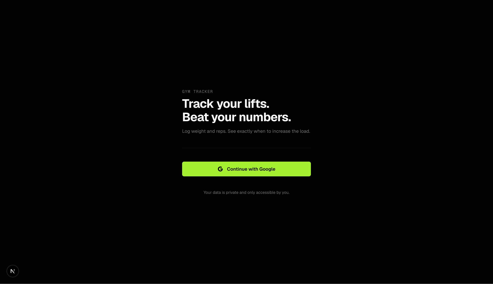
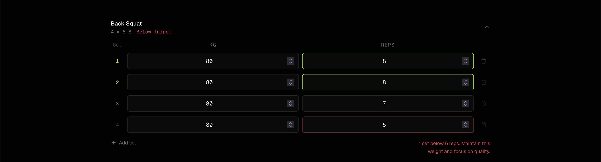

# Gym Tracker

A minimal, dark mode web app for tracking gym progress.



---

## Features

**Log workouts fast**
- Exercises auto populate from your program
- `[kg] × [reps]` entry per set, `Enter` advances to the next field
- Live progression status updates as you type

**Analyse progress per exercise**



- Weight over time line chart
- Total volume bar chart
- Last 8 sessions in a compact table

**History**



- GitHub-style 52 week contribution calendar
- Expandable session log with lazy loaded set details

**Program management**



---

## Stack

| Layer | Tech |
|---|---|
| Framework | Next.js 16 (App Router, Turbopack) |
| Styling | Tailwind CSS v4 |
| Components | shadcn/ui (Base UI) |
| Auth | Better Auth + Google OAuth |
| Database | PostgreSQL |
| ORM | Drizzle ORM |
| Language | TypeScript |

---

## Getting Started

### 1. Clone and install

```bash
git clone <repo-url>
cd gym
npm install
```

### 2. Environment variables

Copy the example and fill in your values:

```bash
cp .env.local.example .env.local
```

| Variable | Description |
|---|---|
| `DATABASE_URL` | PostgreSQL connection string |
| `BETTER_AUTH_SECRET` | Random secret (32+ chars) |
| `BETTER_AUTH_URL` | App base URL (e.g. `http://localhost:3000`) |
| `NEXT_PUBLIC_APP_URL` | Same as above |
| `GOOGLE_CLIENT_ID` | From Google Cloud Console |
| `GOOGLE_CLIENT_SECRET` | From Google Cloud Console |

**Google OAuth setup:**
1. Go to [Google Cloud Console](https://console.cloud.google.com/) → APIs & Services → Credentials
2. Create an OAuth 2.0 Client ID (Web application)
3. Add `http://localhost:3000/api/auth/callback/google` as an authorised redirect URI

### 3. Push the database schema

```bash
npm run db:push
```

### 4. Run

```bash
npm run dev
```

Open [http://localhost:3000](http://localhost:3000), sign in with Google, then hit **"Load my program"** on the log page to seed your exercises.



---

## Database Scripts

```bash
npm run db:push      # Push schema changes to the database
npm run db:studio    # Open Drizzle Studio (visual DB browser)
npm run db:generate  # Generate migration files
```

---

## Progression Logic

The app follows the **rep-first** rule from the training program:

> Never increase weight simply because it "feels light" if rep targets have not been achieved.

For a target of `3 × 8–10`:

| Session | Set 1 | Set 2 | Set 3 | Status |
|---|---|---|---|---|
| Week 1 | 8 | 8 | 8 | Keep going |
| Week 2 | 9 | 8 | 8 | Keep going |
| Week 3 | 10 | 9 | 8 | Keep going |
| Week 4 | 10 | 10 | 10 | **Increase weight** |

The progression badge updates live as you enter reps.



---

## Project Structure

```
src/
├── app/
│   ├── (app)/          # Authenticated pages
│   │   ├── page.tsx    # Dashboard
│   │   ├── log/        # Log workout (primary screen)
│   │   ├── progress/   # Per-exercise charts
│   │   ├── history/    # Session history + calendar
│   │   └── exercises/  # Manage exercise list
│   ├── api/
│   │   ├── auth/       # Better Auth handler
│   │   ├── sessions/   # CRUD for workout sessions
│   │   ├── exercises/  # CRUD for exercises
│   │   └── progress/   # Historical data for charts
│   └── login/          # Google sign-in page
├── db/
│   ├── schema.ts       # Drizzle schema
│   ├── index.ts        # DB connection
│   └── seed.ts         # Exercise seed data
└── lib/
    ├── auth.ts         # Better Auth server config
    ├── auth-client.ts  # Better Auth client hooks
    ├── progression.ts  # Rep-first progression logic
    └── server-auth.ts  # Session helpers
```
